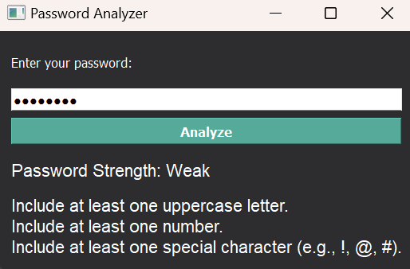

# Password Analyzer

A password analyzer application designed to evaluate and improve password strength based on common security criteria.

## Features

- **Password Strength Rating**: Assess the strength of your password with ratings like Strong, Moderate, or Weak.
- **Actionable Recommendations**: Get specific suggestions to enhance your password security.
- **User-Friendly Interface**: Easy-to-use GUI for quick and effective password analysis.

## Screenshots

<p align="center">
  
  <br/><i>Application User Window</i>
</p>

<p align="center">
  
  <br/><i>Weak Password Strength Rating</i>
</p>

<p align="center">
  
  <br/><i>Moderate Password Strength Rating</i>
</p>

<p align="center">
  
  <br/><i>Strong Password Strength Rating</i>
</p>


## Installation

1. **Clone the Repository**:
    ```sh
    git clone https://github.com/MaryamFatima16/Password-Analyzer.git
    cd Password-Analyzer
    ```

2. **Install Required Packages**:
    Make sure you have Python 3.6 or above installed. Then, install the required Python packages:
    ```sh
    pip install PyQt5
    ```

3. **Run the Application**:
    Launch the application with:
    ```sh
    python Password_Analyzer.py
    ```

## Usage

1. **Launch the Application**: Open the Password Analyzer application.
2. **Enter Password**: Type your password into the input field.
3. **Analyze**: Click the "Analyze" button to evaluate your password.
4. **View Results**: See the strength rating and recommendations for improving your password.

## Password Analysis

- **Strength Rating**: Based on length, character variety (uppercase, lowercase, numbers, special characters).
- **Recommendations**: Suggestions provided if the password does not meet the security criteria.

## Conclusion

The Password Analyzer is a practical tool designed to help you assess and improve the security of your passwords with ease. By evaluating key criteria and providing actionable recommendations, it empowers users to create stronger and more secure passwords. Whether you're looking to enhance your personal security or ensure compliance with security best practices, this application offers a user-friendly solution to meet your needs. Explore the features, follow the simple installation and usage steps, and take control of your password security today.

---

